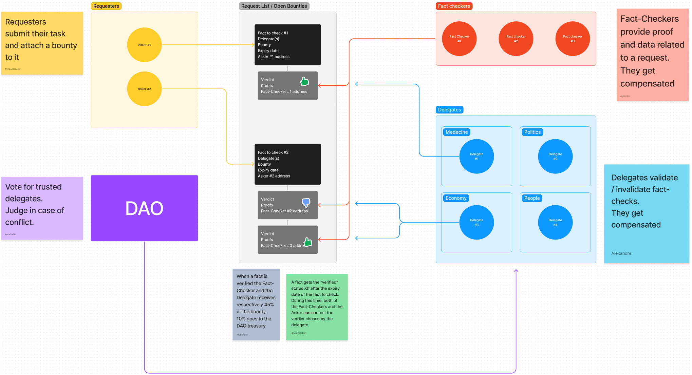

# defacto-dapp
Decentralized platform for incentivized journalism and fact-checking.

# How to setup the project
1) Clone [our repository][0]
2) In the repository run the following commands:
    ```
    docker compose up --build
    ```
3) The frontend is served on http://localhost:3000/

*The backend runs on http://localhost:8080/*

# Problem
The internet makes it easy for billions of people to access information with a few simple keystrokes. However, it also makes it easy to spread false information.
The best way to counter fake news is to conduct your own research.
Unfortunately, this requires learning  how to evaluate sources of information, where to find reputable information, and where to look for fact-checking tools. A process which can be time consuming.


# Solution

News is just information that is factually correct and accurately represents events. Gathering that information is part of the task, but evaluating if it is factually correct is another. And those two tasks can be "outsourced" for a fee.

The internet is an already established network that provides an vast amount of individual databases, skillsets and capabilities in each person.

- DeFacts allows the pairing of :

 ENTITY A : seeking to verify some kind of data and willing to pay a variable fee (the bounty) to get the job done : the Requester.

ENTITY B : seeking to earn compensation by doing research work. Knowing how and where to find information is the process the Fact-Checker does.

ENTITY C : seeking to put their qualifications at work and in the process earn compensation. Reviewing responses of bounties and officially approving them is the role of the Delegate.

- How does it work : 

DeFacts acts similar to an open marketplace, where a Requester can at any time post a Request in the open bounties list.
The Request must include some details such as time allocated for the task, the field in question etc.

There, any Fact-Checker can submit a response including all the information gathered during their research, while the timer of the request is still active.

Once the timer reaches its end, a Delegate assigned to the Request can verify the information provided by the Fact-Checker and validate the response. This validation will distribute the funds locked in the bounty between himself and the Fact-Checker.

- The benefits :

The protocol was designed with specific goals in mind.

Goal 1 : Personal Privacy 

Requesters and Fact-Checkers have no restrictions when using the platform. They only need a wallet adress in order to connect to the service and interact with the blockchain.

Delegates have a verification role, and act as "proof of validity". They are the only entity who must be registered and must provide relevant personal information used to assert their expertise level / relevance in a given field (medecine, mathematics, criminal law, religion, international trade, agriculture, modern culture, history.....).

Goal 2 : Bias Resistance

Anonymity of the Fact-Checkers and Requesters means no one can block, hide, delete information that they do not like or do not want to be shown. The bounty on the request acts as a beacon attracting information, disregarding human biases based on who or where the information came from. Only the validity of the data (evaluated by the Delegates) matter.

Goal 3 : Censorship Resistance

We use multiple IPFS endpoints, and we encourage end-user to take custody of their own files.

Goal 4 : Include Financial Dynamics

It is in the interest of all the parties involved in a bounty to do "honest" work because there is something to be gained by each.
The Requester gains information.
The Fact-Checker earns a compensation for work done.
The Delegate earns a compensation for validating information and gains reputation as a trustable source of knowledge and expertise.

Goal 5 : Global Inclusivity

Thanks to blockchain technology, financial transactions can be made with anyone across world. The protocol will have a very wide and diverse net of participants who in turn provide information and knowledge on a global scale.

Goal 6 : Traceability

Blockchain technology provides us with an immutable ledger of information validation. Allowing anyone to trace back the source of mis-information or wrong assessments.


# Mechanism Chart

The link below redirects to a figma diagram detailing the protocol: 




https://www.figma.com/file/FxWcivozp35j2cjz3n5dy9/DeFacto-protocol?node-id=0%3A1&t=x2ITp4sBNX8DzGNS-1


# Facility
The project use docker. Make sure you have [Docker][1] installed on your machine.

To start the project do the following commands:
```
docker compose up --build
``` 
# The team
We are DeFacts

## Members
Alexandre Schaffner, Clément Saunier, Mickael Riess, Maxime Noel

## What we learned

# Features

As an upgrde to this prototype :

The web interface would provide a rating system of Fact-Checkers, allowing them to earn reputation points as they keep bringing good data.

# Demo

[0]: git@github.com:clement4saunier/defacto-dapp.git
[1]: https://docs.docker.com/engine/install/
